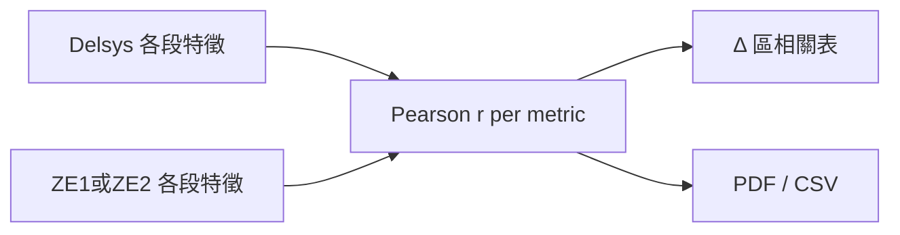

---
todos:
  - id: corr-core
    status: completed
    content: 'features.py: pearson + feature_correlations'
  - id: corr-compare
    status: completed
    content: 'compare.py: attach correlation on ZE1/ZE2 feature compare'
  - id: corr-ui
    status: completed
    content: streamlit Δ section show correlation table
  - id: corr-export
    status: completed
    content: export_report PDF/CSV include correlation
name: Feature correlation coeffs
overview: 在特徵「一起（含 Δ）」結果中，對各特徵指標（duration / RMS / iEMG / MPF…）計算 Delsys 與裝置跨收縮區間的 Pearson 相關係數，並顯示於 Δ 區與匯出。
isProject: false
---

# 特徵結果加上相關係數

## 做法

對「一起（含 Δ）」產生的成對特徵列，**每個指標各算一次 Pearson *r***：

- 輸入：第 1…N 段收縮的 Delsys 值 vs ZE1/ZE2 值（同一 `index` 對齊）
- 輸出：例如 `{ "rms": 0.98, "iemg": 0.95, "mpf": 0.72, … }`
- 至少 2 組有效數值才算；不足或任一邊缺值則該指標為 `null`
- 不改波形疊圖、不做整段訊號相關

## 實作位置

1. **[`features.py`](features.py)**  
   - 新增 `pearson_corr(xs, ys) -> float | None`  
   - 新增 `feature_correlations(left_rows, right_rows, metrics) -> dict[str, float | None]`  
   - 可在 `compare_feature_rows` 旁呼叫，或由 compare 層組裝

2. **[`compare.py`](compare.py)**  
   - `build_feature_compare` / `build_feature_compare_ze2` 回傳多加 `"correlation": {...}`  
   - `note` 補一句說明：相關為跨收縮區間的 Pearson *r*

3. **[`streamlit_app.py`](streamlit_app.py)**  
   - 「差異對照 Δ」區塊：在現有 Δ/% 表下方加一小表  
     - 欄位：`metric`、`r`  
   - caption：`r = 1 完全同向；跨 N 段收縮對齊計算`

4. **[`export_report.py`](export_report.py)**  
   - PDF：Δ 段後加「相關係數」表  
   - ZIP CSV：新增 `features_correlation.csv`

## 不改動

- 單檔特徵表（僅 Delsys / 僅 ZE）不顯示相關（沒有對照端）
- 波形分頁、收縮區間分頁不動
